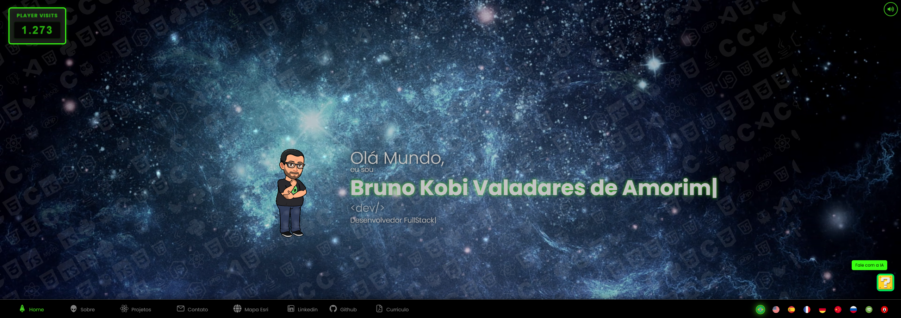
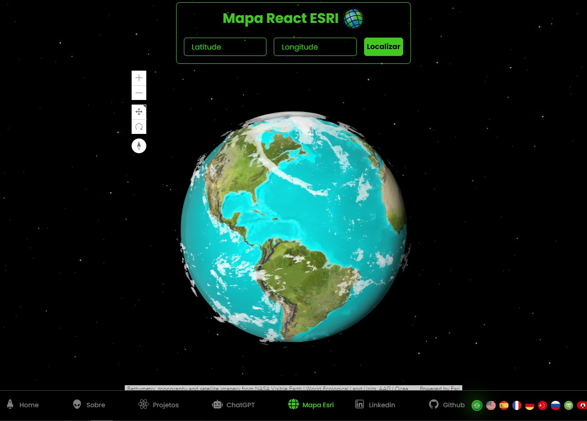

# Portifolio de Bruno Kobi Valadares de Amorim

<a href="https://brunokobi.netlify.app/">`Visite o Site `</a>
 

Desenvolvido com react
Sistema de multilinguagem onde possue 9 idiomas :Klingon (Star Trek), Português, Inglês, Espanhol, Francês, Alemão, Chinês, Russo e Árabe.
Integração com mapas da Esri 
Sistema de conversão de texto pra áudio, para melhor a acessibilidade do sistema

No diretório do projeto, você pode executar:

## yarn start

Inicia o aplicativo no modo de desenvolvimento.
Abra http://localhost:3000 para visualizá-lo no seu navegador.

A página será recarregada quando você fizer alterações.
Você também pode ver quaisquer erros de lint no console.
