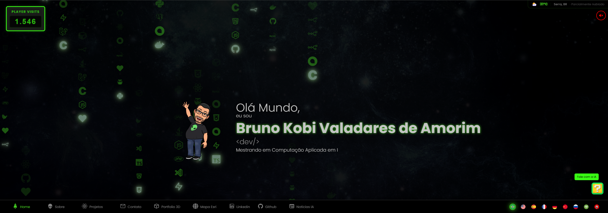

# 🛸 Bruno Kobi — Full Stack Developer & AI Systems Engineer

> **"Não é um portfólio. É um ecossistema digital inteligente em produção."**



<p align="center">
  
  
  
</p>

<p align="center">
  
  
  
  
  
  
  
  
  
</p>

<p align="center">
  <a href="https://brunokobi.netlify.app" target="_blank"><strong>🌐 Ver ao vivo</strong></a> ·
  <a href="https://www.linkedin.com/in/brunokobi/" target="_blank">LinkedIn</a> ·
  <a href="https://github.com/brunokobi" target="_blank">GitHub</a>
</p>

---

## 🌌 O que é este projeto?

A maioria dos portfólios é uma página estática com foto e lista de habilidades. Este é diferente.

Este portfólio foi construído como uma **plataforma de software completa**, integrando tecnologias de produção reais: banco de dados com Row Level Security, automação orientada a eventos com IA, mapa 3D geoespacial, feed de notícias em tempo real de **51 fontes globais** com scoring inteligente, tradução automática, clima via GPS, internacionalização em 9 idiomas e acessibilidade com síntese de voz.

Cada feature foi pensada para demonstrar **profundidade técnica real** — não apenas que sei usar uma tecnologia, mas que sei arquitetá-la, integrá-la e colocá-la em produção.

---

## 🏗️ Arquitetura Geral

```
┌─────────────────────────────────────────────────────────┐
│              Browser (React 18 + Vite 5)                │
│  i18n · WeatherBar · NewsPanel · ArcGIS · TextToSpeech  │
└────────────────────┬────────────────────────────────────┘
                     │ HTTPS
        ┌────────────┴────────────┐
        │                         │
        ▼                         ▼
 Netlify Functions          Supabase (BaaS)
 (TypeScript)               PostgreSQL + RLS
 - Proxy RSS feeds          JWT Auth
 - CORS resolver            Edge Functions
        │                         │
        │                    Postgres Trigger
        │                         │
        │                    n8n Webhook
        │                         │
        │                    Google Gemini AI
        │                         │
        │                    Resend (Email)
        │
 Open-Meteo API (clima)
 ipapi.co (geolocalização)
 Google Translate API (tradução)
```

**Princípios adotados:** Clean Architecture · Event-Driven · Serverless First · BaaS · Modularização por domínio

---

## 🛠️ Stack Completa

| Camada | Tecnologia | Uso |
|--------|-----------|-----|
| Frontend | React 18 + Hooks | SPA com Context API |
| Build | Vite 5 | Dev server HMR instantâneo, bundle otimizado |
| UI | Chakra UI v2 | Design system responsivo |
| Animação | Framer Motion v11 | Transições e stagger animations |
| i18n | React-Intl | 9 idiomas + auto-detect por IP |
| Voz | Web Speech API | Text-to-Speech nativo |
| Backend | Supabase | PostgreSQL + Auth + RLS + Edge Functions |
| Automação | n8n (self-hosted) | Workflows event-driven |
| IA | Google Gemini AI | Análise e classificação de mensagens |
| Email | Resend | Transacional |
| Deploy | Netlify | CI/CD + Serverless Functions |
| GIS | ESRI ArcGIS | Mapas 3D interativos |
| Clima | Open-Meteo | API gratuita, sem chave |
| Geoloc. | ipapi.co | IP → país/cidade/coords |

---

## 🚀 Rodando localmente

### Pré-requisitos

- Node.js 18+
- npm 9+
- Conta no [Supabase](https://supabase.com)
- Conta no [Netlify](https://netlify.com) (para as functions)
- Chave de API do [ESRI ArcGIS](https://developers.arcgis.com)

### Instalação

```bash
git clone https://github.com/brunokobi/projeto-portifolio.git
cd projeto-portifolio
npm install
```

### Variáveis de ambiente

Crie um arquivo `.env.local` na raiz:

```env
# Supabase
VITE_SUPABASE_URL=https://xxxx.supabase.co
VITE_SUPABASE_ANON_KEY=eyJhbGciOiJIUzI1NiIs...

# ESRI ArcGIS
VITE_ESRI_API_KEY=AAPTxy8BH...

# Hugging Face (páginas de IA experimental)
VITE_HUGGING_FACE_API_KEY=hf_xxxx

# n8n (webhook para o fluxo de contato — usado na Netlify Function)
N8N_WEBHOOK_URL=https://seu-n8n.com/webhook/contato
```

### Rodando

```bash
npm start          # Desenvolvimento (Vite dev server, porta 3000)
npm run build      # Build de produção (saída em /dist)
npm run preview    # Pré-visualizar build de produção localmente
```

> Para testar as Netlify Functions localmente, instale `netlify-cli` e use `netlify dev` no lugar de `npm start`.

---

## 📰 Feature: Painel de Notícias de IA em Tempo Real

> **Complexidade:** ⭐⭐⭐⭐⭐ — CORS proxy serverless + RSS parsing multi-formato + scoring inteligente + filtro de relevância + tradução automática + carrossel adaptativo

Um painel completo que agrega **51 feeds RSS** de fontes globais de IA, com sistema de pontuação por relevância, filtragem anti-spam, tradução automática para português e carrossel principal com seleção das melhores notícias do momento.

### Por que é complexo?

Feeds RSS não podem ser consumidos diretamente pelo browser por restrições de **CORS**. A solução foi criar uma **Netlify Function em TypeScript** que atua como proxy: o frontend chama `/.netlify/functions/news?url=<feed>`, a function busca o XML no servidor e o retorna com os headers corretos.

Além disso, feeds RSS possuem formatos diferentes (RSS 2.0, Atom, Media RSS) e guardam imagens em campos distintos: `media:thumbnail`, `media:content`, `enclosure` ou dentro do HTML da descrição.

### Fluxo completo

```
Browser
  → /.netlify/functions/news?url=<encoded_feed_url>
  → Netlify Function busca XML do feed original
  → Retorna XML com headers CORS corretos
Browser
  → parseRSS() extrai: título, link, data, imagem
  → cleanDesc() remove boilerplate legal dos RSS (regex patterns)
  → translateArticles() traduz títulos EN→PT via Google Translate (sem chave)
  → isSpam() filtra promoções, reviews de produtos, eletrônicos de consumo
  → isRelevant() filtra fontes mistas: exige keyword de IA/dev/tech no conteúdo
  → scoreArticle() pontua por prestige da fonte + keywords + recência
  → heroScore() seleciona carrossel: recência pesada + importância (independe do sortBy)
  → Ordena por importância ou data (escolha do usuário)
  → Exibe com animação stagger + cache in-memory por 5 minutos
```

### Sistema de scoring

```javascript
const SOURCE_PRESTIGE = {
  "MIT Tech Rev": 20, "MIT News": 20, "Google Res.": 18,
  "ETH Zurich": 16,   "IEEE Spectrum": 16, "BAIR": 15,
  "TUM": 15,          "The Gradient": 14,  "Reuters Inst.": 13, ...
};

// Carrossel: recência pesada — artigos < 1h ganham +60 pts
function heroScore(a) {
  let s = SOURCE_PRESTIGE[a.source?.name] || 5;
  const h = (Date.now() - a.date) / 3_600_000;
  s += h < 1 ? 60 : h < 3 ? 50 : h < 6 ? 40 : h < 12 ? 28 : h < 24 ? 16 : 0;
  // + keywords críticas (AGI, regulation, acquisition): +18 cada
  // + keywords altas (GPT, Claude, NVIDIA, launch): +10 cada
  return s;
}
```

### Filtro de relevância por fonte

Fontes mistas (Tecnoblog, NeoFeed, SCMP, ETH Zurich etc.) só exibem artigos que contenham ao menos uma keyword de IA/dev: `inteligência artificial`, `machine learning`, `llm`, `openai`, `kubernetes`, `cibersegurança`...

### Netlify Function (proxy RSS)

```typescript
// netlify/functions/news.ts
export const handler: Handler = async (event) => {
  const feedUrl = event.queryStringParameters?.url;
  const res = await fetch(feedUrl, {
    headers: { "User-Agent": "Mozilla/5.0", "Accept": "application/rss+xml, */*" },
    signal: AbortSignal.timeout(8000),
  });
  return {
    statusCode: 200,
    headers: { "Content-Type": "application/xml", "Access-Control-Allow-Origin": "*", "Cache-Control": "public, max-age=300" },
    body: await res.text(),
  };
};
```

### Fontes ativas (51)

**Brasil 🇧🇷** — SWEN.AI · AINEWS · Exame IA · NeoFeed · Tecnoblog · Olhar Digital · TabNews · Manual Usuário · MIT Tech BR · Brazil Journal

**Pesquisa 🔬** — MIT News · MIT Tech Rev · Google Research · BAIR · The Gradient · IEEE Spectrum · IEEE TV AI · DeepMind · arXiv cs.AI · Apple ML · Stanford AI · ScienceDaily · **ETH Zurich** · **TUM**

**Indústria 🌎** — The Verge · TechCrunch · Wired AI · AI News · AI Insider · AI Weekly · OpenAI · NVIDIA · MarkTechPost · AWS ML · **Reuters Inst. Oxford**

**Modelos & Tools** — HuggingFace · KDnuggets · fast.ai · TensorFlow · Towards AI · LangChain

**Ásia & China 🌏** — AI Singapore · RIKEN AIP · Synced · **ChinAI Newsletter** · **SCMP Tech**

**Engenharia 💻** — Pragmatic Eng. · Martin Fowler · Netflix Tech · n8n Blog · Supabase

---

## 🌐 Feature: Internacionalização com Detecção Automática por IP

> **Complexidade:** ⭐⭐⭐ — Geolocalização por IP + mapeamento país→idioma + Context API sem reload

Na primeira visita, o site já aparece **no idioma correto** para o país de origem do visitante. A troca de idioma ocorre via **React Context** — sem `window.location.reload()`, apenas um re-render imediato.

```javascript
// src/contexts/LanguageContext.jsx
export const LanguageProvider = ({ children }) => {
  const [locale, setLocale] = useState(getStoredLang);

  const setLanguage = useCallback((lang) => {
    localStorage.setItem("i18nConfig", JSON.stringify({ selectedLang: lang }));
    setLocale(lang); // re-render imediato, sem reload de página
  }, []);

  return <LanguageContext.Provider value={{ locale, setLanguage }}>{children}</LanguageContext.Provider>;
};
```

### Idiomas suportados (9)

| Idioma | Código | Cobertura |
|--------|--------|-----------|
| Português | `pt` | Brasil, Portugal |
| Inglês | `en` | EUA, UK, Austrália, Canadá + outros |
| Espanhol | `es` | 17 países |
| Francês | `fr` | França, Bélgica, Suíça + outros |
| Alemão | `de` | Alemanha, Áustria |
| Chinês | `zh` | China, Taiwan, HK, Macau, Singapura |
| Russo | `ru` | Rússia, Bielorrússia, Cazaquistão |
| Árabe | `ar` | 14 países do Oriente Médio e Norte da África |
| Klingon | `kl` | 🖖 |

---

## 🌤️ Feature: Clima em Tempo Real com Fallback GPS → IP

> **Complexidade:** ⭐⭐⭐⭐ — Dual-source geolocation + API meteorológica + 22 códigos WMO

```
1ª tentativa: navigator.geolocation (GPS do browser) → precisão de metros
Fallback:      ipapi.co (IP geolocation) → precisão de 1–10 km, sem permissão
```

Coordenadas enviadas à **Open-Meteo API** — gratuita, sem chave de API. 22 condições WMO mapeadas para ícones e descrições em português.

---

## 🛰️ Feature: Contato com Automação IA (Event-Driven)

> **Complexidade:** ⭐⭐⭐⭐⭐ — Trigger PostgreSQL → Edge Function → Webhook → n8n → Gemini AI → Email

```
1. Usuário envia formulário
2. Frontend → supabase.from('contato').insert({...})
3. PostgreSQL persiste com RLS ativo
4. Trigger SQL ativa Edge Function (Deno)
5. Edge Function → webhook n8n
6. n8n → Google Gemini (análise de sentimento + classificação)
7. Gemini → n8n formata e-mail personalizado
8. Resend entrega o e-mail
```

```sql
create table contato (
  id uuid primary key default gen_random_uuid(),
  nome text not null,
  email text not null,
  mensagem text not null,
  created_at timestamptz default now()
);

alter table contato enable row level security;
create policy "allow_insert" on contato for insert with check (true);
```

---

## 📊 Feature: Contador de Visitas Atômico

> **Complexidade:** ⭐⭐⭐ — Supabase RPC atômica + visual de placa enferrujada + Text-to-Speech

Contador persistido em PostgreSQL com incremento via **RPC atômica** — sem race conditions entre visitantes simultâneos. Visual de placar industrial com ferrugem, rebites, dígitos em verde matrix e scanlines em CSS puro.

```sql
create or replace function increment_views()
returns bigint language sql as $$
  update page_views set count = count + 1 where id = 1
  returning count;
$$;
```

```javascript
const { data } = await supabase.rpc("increment_views");
setVisits(data);
```

---

## 🌍 Feature: Mapa 3D Geoespacial (ESRI ArcGIS)

> **Complexidade:** ⭐⭐⭐⭐ — ArcGIS API + lazy loading + WebGL 3D + fotos próprias nos marcadores

Módulo de mapa com a **ESRI ArcGIS Maps SDK** em WebGL:
- Terreno 3D interativo
- Globo animado com nuvens (NASA textures)
- Marcadores customizados com **fotos próprias** nos pontos turísticos
- Geolocalização dinâmica do usuário

---

## 🚌 Feature: Frota Realtime RJ (Projeto externo)

> **[frotarealtime.netlify.app](https://frotarealtime.netlify.app/)** — rastreamento de +4.000 ônibus do Rio de Janeiro via API SPPO

- **Serverless proxy** comprime os dados em 70% antes de enviar ao browser
- **requestAnimationFrame** com interpolação garante animação a 60 FPS
- Velocidade dos veículos calculada e colorizada via **MapLibre GL** (GPU)
- Agrupamento automático por nível de zoom
- Cada ônibus mantém as últimas 10 posições (rastro de trajetória)
- Fallback para `localStorage` com indicação de data dos dados em caso de falha na API

---

## ♿ Acessibilidade com Síntese de Voz

Text-to-Speech nativo via **Web Speech API** — zero dependências, zero custo. Hover em qualquer texto lê o conteúdo em voz alta no idioma selecionado.

```javascript
const falar = (texto) => {
  const synth = window.speechSynthesis;
  const word = new SpeechSynthesisUtterance(texto);
  word.lang = langMap[selectedLang] || "pt-BR";
  synth.cancel();
  if (localStorage.getItem("Audio") === "on") synth.speak(word);
};
```

---

## 📱 Responsividade Mobile

| Componente | Ajuste |
|-----------|--------|
| Carrossel hero (News) | Imagem como fundo com overlay — sem overflow |
| Categorias de notícias | Layout compacto com scroll horizontal drag-to-scroll |
| Carrossel de certificados | CSS nativo com dots e botões anterior/próximo |
| ProjectCard | Largura fluida `95vw`, tags com `wrap` automático |
| Modal de Contato | `size="full"` + `scrollBehavior="inside"` |
| Menu de navegação | Scroll horizontal sem scrollbar visível |

---

## 🔐 Segurança

| Camada | Mecanismo |
|--------|-----------|
| Banco de dados | Row Level Security (RLS) no Supabase |
| Autenticação | JWT via Supabase Auth |
| Segredos | Variáveis `VITE_*` — nunca expostas no bundle de produção |
| CORS | Controlado pelas Netlify Functions |
| Error handling | ErrorBoundary global com tela de recuperação em PT |

---

## 🧬 Diferenciais que fazem diferença

| Feature | Por que impressiona |
|---------|-------------------|
| 🔄 Pipeline Event-Driven | Trigger SQL → n8n → Gemini → Email, sem polling |
| 📰 51 RSS Feeds + scoring | CORS proxy serverless + filtro relevância + heroScore() + Google Translate sem chave |
| 🌐 9 idiomas + auto-detect | Cobre 50+ países, troca sem reload via Context API |
| 🌤️ Clima GPS → IP fallback | Máxima precisão sem degradar UX |
| 🗺️ Mapa 3D WebGL | ArcGIS em produção com lazy loading |
| ♿ Text-to-Speech | Zero dependências, Web API nativa |
| 🔒 RLS + JWT | Segurança no nível do banco, não só da aplicação |
| ⚛️ RPC atômica | Contador sem race conditions |
| 🚌 GPS Fleet 60 FPS | +4.000 veículos em tempo real com interpolação WebGL |
| ⚡ Vite 5 | HMR instantâneo, build 3× mais rápido que CRA |

---

## 📈 Roadmap

- [x] Filtros interativos por categoria no painel de notícias
- [x] Carrossel principal com seleção inteligente (heroScore)
- [x] Filtro de relevância por fonte (MIXED_SOURCES + AI_DEV_KEYWORDS)
- [ ] Notificações push de breaking news (Service Worker + PWA)
- [ ] Dashboard de analytics com métricas de visitas
- [ ] CI/CD com testes automatizados
- [ ] Observabilidade com Sentry
- [ ] Migração esri-loader → @arcgis/map-components

---

## 🛸 Sobre Bruno Kobi

Full Stack Developer & AI Systems Engineer especializado em transformar complexidade técnica em produtos que funcionam em produção.

Não apenas sei usar as ferramentas — sei **quando usá-las, como integrá-las e o que acontece quando algo falha**.

🔗 [brunokobi.netlify.app](https://brunokobi.netlify.app) · [LinkedIn](https://www.linkedin.com/in/brunokobi/) · [GitHub](https://github.com/brunokobi)
