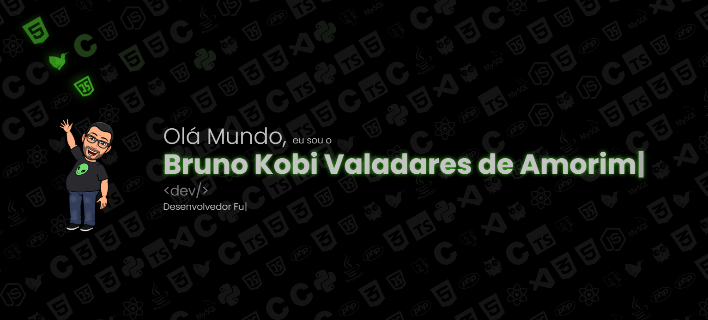

# 🛸 Bruno Kobi | Full Stack Developer & AI Systems Engineer 🛸



<p align="center">

  <!-- Status -->
  
  

  <!-- Frontend -->
  
  
  
  

  <!-- Backend -->
  
  
  
  

  <!-- AI -->
  

  <!-- GIS -->
  

  <!-- Arquitetura -->
  
  
  

</p>

------------------------------------------------------------------------

## 🌌 Visão Estratégica

Este portfólio foi projetado como um **ecossistema digital
inteligente**, integrando:

-   ⚡ Engenharia Full Stack
-   🌍 Geoprocessamento (GIS)
-   🤖 Inteligência Artificial Conversacional
-   🔁 Arquitetura orientada a eventos
-   ♿ Acessibilidade extrema
-   🌐 Internacionalização avançada

Não é apenas uma interface visual --- é uma demonstração prática de
arquitetura moderna em produção.

------------------------------------------------------------------------

## 🧠 Arquitetura de Alto Nível

Princípios adotados:

-   Clean Architecture
-   Event-Driven Design
-   Backend-as-a-Service
-   Serverless First
-   Modularização por Domínio

```{=html}
<!-- -->
````

```
Client (React 18)
   ↓
Supabase (Auth + PostgreSQL + Edge Functions)
   ↓
Postgres Trigger
   ↓
Webhook
   ↓
n8n (Orquestração)
   ↓
Google Gemini AI
   ↓
Resend (Email)
```

---

## 🛠️ Stack Tecnológica

### 🎨 Frontend

* React 18 (Hooks + Context API)
* Chakra UI (Design System acessível)
* Framer Motion (Animações fluidas)
* React-Intl (9 idiomas)
* Web Speech API (Text-to-Speech)
* Lazy Loading + Code Splitting

### 🧠 Backend & Infraestrutura

**Supabase** - PostgreSQL - JWT Authentication - Row Level Security
(RLS) - Edge Functions (Deno Runtime) - Triggers automatizados

**n8n** - Workflows assíncronos - Integração com APIs externas -
Orquestração desacoplada do frontend - Pipeline inteligente

**Inteligência Artificial** - Google Gemini AI - Análise de sentimento -
Classificação automática de mensagens - Respostas inteligentes -
Fallback para atendimento humano

---

## 🌍 Módulo Geoespacial (GIS)

* ESRI ArcGIS API
* Mapas 3D interativos
* Geolocalização dinâmica
* Visualização espacial estratégica

---

## 🛰️ Fluxo de Comunicação (Uplink)

1. Validação e envio via Supabase SDK
2. Persistência na tabela `contato`
3. Trigger PostgreSQL ativa Edge Function
4. Webhook dispara fluxo no n8n
5. IA classifica mensagem
6. Notificação via Resend

---

## 🔐 Segurança

* JWT Authentication
* Row Level Security (RLS)
* Sanitização de inputs
* Rate limiting
* Variáveis de ambiente isoladas

---

## ⚙️ Execução Local

```bash
git clone https://github.com/brunokobi/projeto-portifolio.git
yarn install
cp .env.example .env.local
yarn start
```

---

## 🌐 Variáveis de Ambiente

```
VITE_SUPABASE_URL=
VITE_SUPABASE_ANON_KEY=
SUPABASE_SERVICE_ROLE_KEY=
N8N_WEBHOOK_URL=
GOOGLE_AI_KEY=
RESEND_API_KEY=
```

---

## 📈 Roadmap

* Sistema de fila inteligente com IA
* Dashboard administrativo
* Observabilidade (Sentry / OpenTelemetry)
* CI/CD automatizado
* Deploy multi-região

---

## 🧬 Diferenciais Técnicos

✔ Arquitetura orientada a eventos
✔ Serverless real
✔ Integração IA + Automação
✔ Geoprocessamento 3D
✔ Sistema multilíngue
✔ Acessibilidade com síntese de voz

---

## 🛸 Sobre Bruno Kobi

Full Stack Developer especializado em:

* Sistemas escaláveis
* Inteligência Artificial aplicada
* Automação inteligente
* Arquitetura moderna (Serverless & Event Driven)

Construindo sistemas que não apenas funcionam --- mas pensam,
automatizam e evoluem.
```
